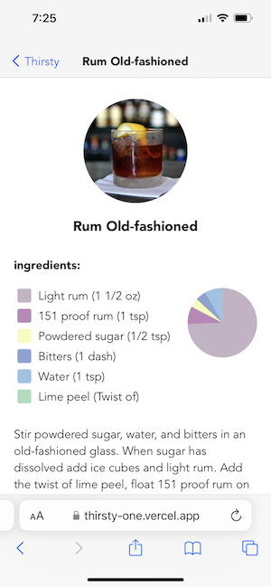

# Thirsty &nbsp; 

This is a [Next.js](https://nextjs.org/) project bootstrapped with [`create-next-app`](https://github.com/vercel/next.js/tree/canary/packages/create-next-app).

## Description

This web application allows users to search for a cocktail by name. Thanks to TheCocktailDB's massive databse of cocktails, ingredients, and recipes, users are able to get quick results and detailed information on hundreds of mixed drinks.

## Table of Contents

-  [Deployed Application](http://https://thirsty-one.vercel.app)
-  [Screenshots](#screenshots)
-  [Usage](#usage)
-  [License](#license)
-  [Contributing](#contributing)
-  [Questions](#questions)

## Screenshots

## Usage

1. Search for a cocktail by name.
2. The search results are displayed on the page as you type. There's no need to press enter.
   -  If your search returned zero results, an error message will let you know.
3. Select a drink by tapping on mobile or clicking on desktop.
4. You will be presented with the full drink details, including ingredients and instructions.
5. If you would like to return to the search page, select "Thirsty" in the top left corner.

## License

MIT License

## Contributing

-  [React.js](https://react.dev)
-  [Next.js](https://nextjs.org)
-  [react-chartjs-2](https://react-chartjs-2.js.org/examples/pie-chart)
-  [React Loading Skeleton](https://github.com/dvtng/react-loading-skeleton)
-  [TheCocktailDB](https://www.thecocktaildb.com)
-  [Cocktail icon created by Freepik - Flaticon](https://www.flaticon.com/free-icons/cocktail)

## Questions

[mreliwood on GitHub](https://github.com/mreliwood) &nbsp; | &nbsp; [contact.eliwood@gmail.com](mailto:contact.eliwood@gmail.com)
